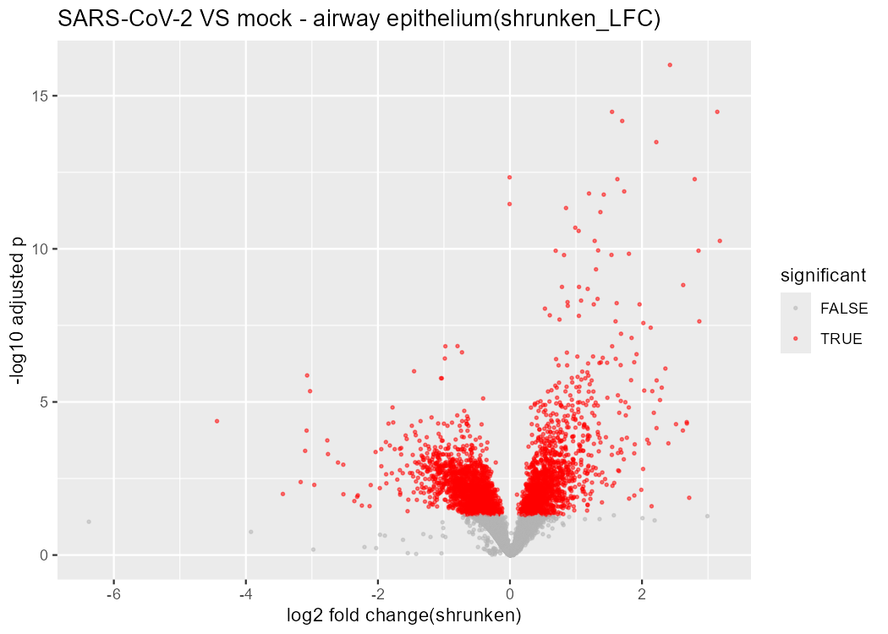

# Bulk RNA-seq Differential Expression — SARS-CoV-2 Host Response

Which genes respond to **SARS-CoV-2 infection** in human airway epithelial cells? A differential-
expression (DE) analysis of Blanco-Melo et al. 2020 (**GEO GSE147507**), implemented in **R (DESeq2)**
and **Python (PyDESeq2)** with matching results, completed with **GO/KEGG functional enrichment (ORA +
GSEA)** to turn the gene list into pathways.



## Aim

Which genes are differentially expressed when human airway epithelial cells are infected with
SARS-CoV-2 versus mock — and how much does correctly controlling for the cell-line confounder in the
statistical model change the answer?

## Objective

Run a real DESeq2/PyDESeq2 differential-expression analysis on public SARS-CoV-2 infection RNA-seq data,
demonstrate concretely how the choice of design formula (not just the code) determines whether the
result is correct, and extend the gene list into biological pathways via GO/KEGG over-representation
analysis and GSEA — cross-validated across two independent language implementations.

## Data fetch

Real, raw human RNA-seq read counts from **GEO GSE147507** (Blanco-Melo et al., *Cell* 2020), fetched
programmatically — `GEOquery::getGEOSuppFiles()` (R) / pandas reading directly from the GEO FTP
(Python), not a manual download. Three real cell lines used: primary bronchial epithelial (NHBE), A549,
and Calu3, each mock- or SARS-CoV-2-infected (~9 vs 9 samples across the three cell lines).

## Data describe

A gene × sample count matrix — non-negative integer read counts per gene per sample, whose variance
grows with the mean (over-dispersion), which is why DESeq2/PyDESeq2 model counts with a **negative
binomial** distribution rather than a t-test. Sample names were parsed into a metadata table (cell line
+ infection status) as a real, necessary data-wrangling step before any modelling.

## Methods / Workflow — what we did

1. Fetch the raw count matrix from GEO; parse sample names into cell-line/infection metadata; subset to
   the three cell lines, mock vs SARS-CoV-2.
2. Build the DESeqDataSet with design **`~ cell_line + infection`** — control for cell line first, then
   test the infection effect within it; pre-filter low-count genes.
3. Run DESeq2: size-factor normalization (median-of-ratios, correcting for sequencing depth) → per-gene
   dispersion estimation → negative-binomial Wald test → Benjamini-Hochberg FDR correction across ~20k
   genes tested (`padj < 0.05` called significant).
4. Compare two designs (`~ infection` alone vs `~ cell_line + infection`) directly, to demonstrate the
   real, measurable effect of controlling for the confounder.
5. Shrink fold-changes with `apeglm` (`lfcShrink`) for a clean, honestly-ranked volcano plot.
6. Plot sample PCA and the volcano; save full results.
7. **Functional enrichment**: GO/KEGG over-representation analysis (ORA) on the up-regulated genes, and
   GSEA on all genes ranked by `sign(log2FC) × −log10(p)` — turning the raw gene list into pathways.
8. Repeat the entire analysis independently in Python (PyDESeq2 + gseapy) on the identical data and
   design, to cross-validate against the R (DESeq2 + clusterProfiler) implementation.

## Results

| metric | value |
|--------|-------|
| significant genes, `~ cell_line + infection` (`padj<0.05`) | **3,976** |
| significant genes, `~ infection` only | 873 |
| effect of controlling for cell line | **4.5× more DE genes detected** |
| top up-regulated genes | IL36G, IL1A, SOD2, IRAK2, BIRC3, **MX1** |

**R and Python give identical top genes and fold-changes** (e.g. IL36G log₂FC ≈ 2.37, IL1A ≈ 3.25 in
both). Full results: [`results_R/deseq2_results.csv`](results_R/deseq2_results.csv).

**Enrichment**: ORA's top GO term is *cytokine-mediated signaling* (adjusted p ≈ 1×10⁻²⁶); GSEA ranks
*cytokine-cytokine receptor interaction, TNF, NF-κB, NOD-like receptor,* and *JAK-STAT signalling* at
the top (NES ≈ +2.4–2.6, FDR q ≈ 0), while *oxidative phosphorylation* is the strongest down-regulated
pathway (NES ≈ −2.5).

## Biology interpretation of results

Sample PCA is dominated by cell line (PC1 70% + PC2 24% ≈ 94% of total variance) — the real infection
effect is a comparatively subtle within-cell-line shift. This is exactly why the design formula matters
for correctness, not just style: with `~ infection` alone, the large cell-line variance swamps the
signal and only 873 genes reach significance; with `~ cell_line + infection`, that nuisance variance is
explicitly removed and the true infection response is revealed — 3,976 genes, 4.5× more. The top
up-regulated genes are real, recognizable inflammatory cytokines (IL36G, IL1A) and antiviral
interferon-stimulated genes (MX1) — the imbalanced cytokine/interferon host response to SARS-CoV-2
reported in the original Blanco-Melo et al. study. Functional enrichment closes the loop: the gene list
is not a random bag of hits, it collapses into one coherent biological program. Both ORA (top term
*cytokine-mediated signaling*) and GSEA (top pathways *cytokine-cytokine receptor interaction, TNF,
NF-κB, NOD-like receptor, JAK-STAT*) independently agree that infection drives a coordinated
innate-immune/inflammatory response, while oxidative phosphorylation is coordinately repressed — a known
pattern of viral suppression of host energy metabolism, and a pathway-level conclusion the raw
differentially-expressed-gene list alone could not have given.

## Learning through project

The central, transferable lesson: the statistical *design formula* is part of the science, not a coding
detail — the same dataset and the same tool produce a 4.5-fold different gene count depending on whether
a known confounder (cell line) is included in the model, and only the design that actually matches the
real experimental structure gives a trustworthy answer. This generalizes to any grouped/batched
experiment: always check what dominates the variance (here, via PCA) before trusting a naive
single-variable test. Extending a differential-expression gene list into GO/KEGG pathways (ORA + GSEA)
turns a list of gene names into an interpretable biological story, and running both an over-representation
test and a rank-based test (GSEA) independently is itself a useful cross-check, since they can disagree
in informative ways when a threshold-based cutoff misses real, distributed signal.

## Limitations

Three cell lines with few replicates each — modest statistical power; results are cell-culture, not
in-vivo, biology. Gene-level count analysis only; no isoform- or allele-level resolution. Enrichment
inherits real annotation bias (well-studied immune genes are over-represented in GO/KEGG databases); ORA
also depends on the chosen significance threshold and background gene set, and tested pathways overlap
substantially (the tests are not independent). Differential expression and enrichment detect association
with infection status, not causal or mechanistic direction.

## Reproduce

```bash
# R (RStudio)
install.packages(c("tidyverse","BiocManager"))
BiocManager::install(c("DESeq2","GEOquery","apeglm","clusterProfiler","org.Hs.eg.db","enrichplot"))
# open rnaseq_de.R -> Session -> Set Working Directory -> To Source File Location -> Source

# Python (Colab or local Jupyter)
pip install pydeseq2 gseapy pandas matplotlib
# run rnaseq_de.ipynb
```

Data is fetched live from GEO (GSE147507). (GEO downloads are occasionally slow — rerun if a fetch
times out.)

## Tech

`R` (DESeq2, GEOquery, apeglm, clusterProfiler) · `Python` (PyDESeq2, gseapy, pandas) · GEO API ·
negative-binomial GLMs · GO/KEGG enrichment (ORA + GSEA)

## Files

```
rnaseq_de.R                     # R: DESeq2 DE + clusterProfiler enrichment (GO/KEGG ORA + GSEA)
rnaseq_de.ipynb                 # Python: PyDESeq2 DE + gseapy enrichment
results_R/deseq2_results.csv    # full DE results
results_R/volcano.png           # hero: shrunken-LFC volcano
results_R/pca.png               # sample PCA (separates by cell line)
results_R/enrichGO_up_dotplot.png, gseKEGG.csv, enrichGO_up.csv   # enrichment (R)
results_py/…                    # Python equivalents (volcano, enrichr_up.csv, gsea_prerank.csv)
```

## License

All rights reserved — see `LICENSE`. This repository is public for portfolio/demonstration purposes
only; no permission is granted to copy, modify, or reuse any part of it.
